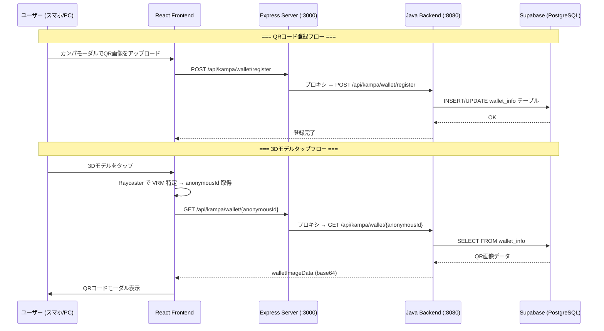

# 3Dモデルタップ → 持ち主のQRコード表示 & Supabase保存

3Dモデルをタップすると、そのモデルの持ち主が登録したQRコード（AirWallet等）がポップアップ表示される機能を実装する。QRコード画像の永続保存先をH2（メモリDB）からSupabaseに変更する。

## User Review Required

> [!IMPORTANT]
> **Supabase の接続情報が必要です。** 以下の情報を教えてください：
> - Supabase プロジェクトURL（例: `https://xxxx.supabase.co`）
> - Supabase API Key（anon/public key）
> - テーブルは自動作成しますか？既存テーブルがありますか？

> [!WARNING]
> **Java バックエンド（z1m/java-unit）の DB を H2 → Supabase (PostgreSQL) に変更します。**
> 現在の H2 メモリDBはサーバー再起動でデータが消えますが、Supabaseに変更することで永続化されます。

## Open Questions

1. **Supabase Storage vs DB**: QRコード画像は **Supabase Storage**（画像ファイルとして保存）と **DB のカラムに Base64 で保存** のどちらが希望ですか？
   - Storage推奨：画像サイズが大きくてもOK、URL直接参照可能
   - Base64 DB保存：現在の仕組みと同じ。シンプルだがDBが重くなる可能性あり

2. **Socket.IO 経由で匿名IDを共有する仕組み**：現在、各参加者は `socket.id` で識別されていますが、`anonymousId`（IndexedDB由来）はサーバーに送っていません。3Dモデルタップ時にそのモデルの「持ち主のQRコード」を引くには、`socket.id → anonymousId` のマッピングが必要です。これを `register_role` 時に一緒に送る形で実装してよいですか？

## Proposed Changes

### 1. シグナリングサーバー（socket.id ↔ anonymousId マッピング）

#### [MODIFY] [server.js](file:///home/me/Documents/d/g1m/g1m/server.js)
- `register_role` イベントで `anonymousId` も受け取り、`participants` Map に保存
- `participants_list` / `participant_joined` イベントに `anonymousId` を含める
- Node.js Express に `/api/kampa` プロキシを追加（Java バックエンドが別ポート8080のため）

---

### 2. Java バックエンド（H2 → Supabase PostgreSQL）

#### [MODIFY] [pom.xml](file:///home/me/Documents/d/g1m/g1m/z1m/java-unit/pom.xml)
- H2 依存を PostgreSQL ドライバに変更

#### [MODIFY] [application.properties](file:///home/me/Documents/d/g1m/g1m/z1m/java-unit/src/main/resources/application.properties)
- データソースを Supabase の PostgreSQL 接続情報に変更

---

### 3. フロントエンド（3Dモデルタップ → QRコード表示）

#### [MODIFY] [App.tsx](file:///home/me/Documents/d/g1m/g1m/frontend/src/App.tsx)

**A. Raycaster による3Dモデルタップ検出**
- `THREE.Raycaster` を使い、canvas のクリック/タッチイベントでどのVRMモデルがタップされたかを判定
- タップされたモデルの `id`（`local`, `bot`, socket.id）→ `anonymousId` → QRコード取得

**B. QRコードモーダルの追加**
- タップ時に `/api/kampa/wallet/{anonymousId}` を呼び出してQRコード画像を取得
- モーダルでQRコード画像を表示（既存のカンパモーダルと同様のデザイン）
- 「閉じる」ボタン付き

**C. `register_role` 時に `anonymousId` を送信**
- Socket.IO の `register_role` 呼び出しに `anonymousId` を追加
- `Participant` interface に `anonymousId` フィールドを追加

**D. Wallet登録の API パスを修正**
- `http://localhost:8080` 直指定 → `/api/kampa/...`（プロキシ経由）に変更して、本番環境でも動くようにする

#### [MODIFY] [App.css](file:///home/me/Documents/d/g1m/g1m/frontend/src/App.css)
- QRコードモーダルのスタイル追加（既存の `modal-overlay` / `modal-content` を再利用）

---

### 4. Vite プロキシ設定

#### [MODIFY] [vite.config.ts](file:///home/me/Documents/d/g1m/g1m/frontend/vite.config.ts)
- `/api/kampa` → `http://localhost:8080` へのプロキシを追加（Java バックエンド用）

---

## データフロー

## Verification Plan

### Automated Tests
- `npm run build` でフロントエンドのビルドが通ることを確認
- ブラウザで3Dモデルをクリックしてモーダルが表示されることを確認

### Manual Verification
- QRコード画像を登録 → 3Dモデルタップ → QRコード表示の一連のフローを確認
- Supabase ダッシュボードでデータが保存されていることを確認
